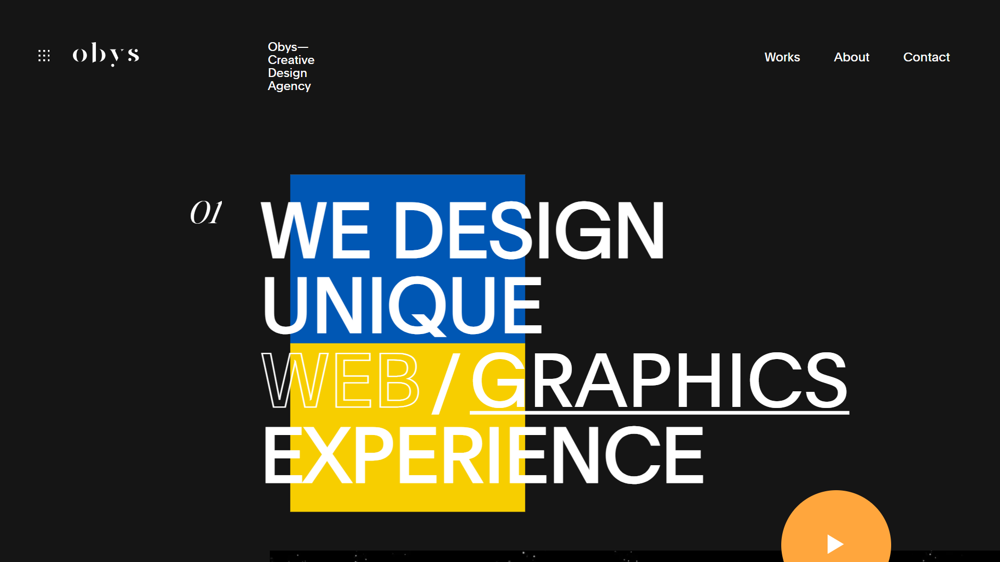
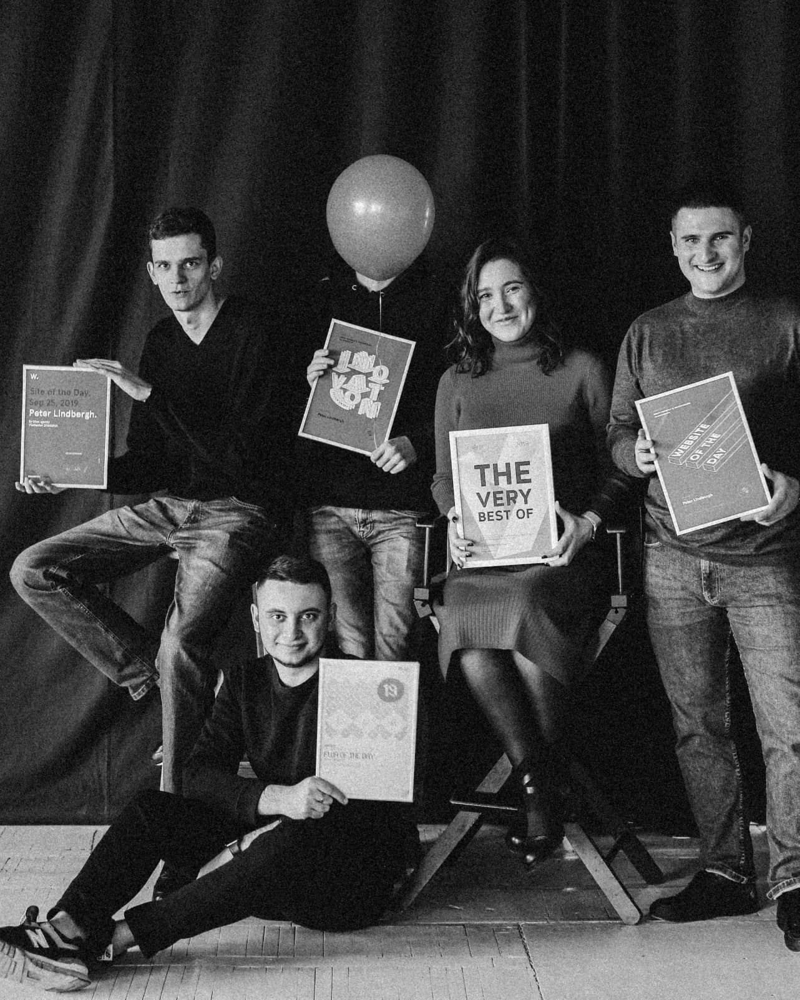
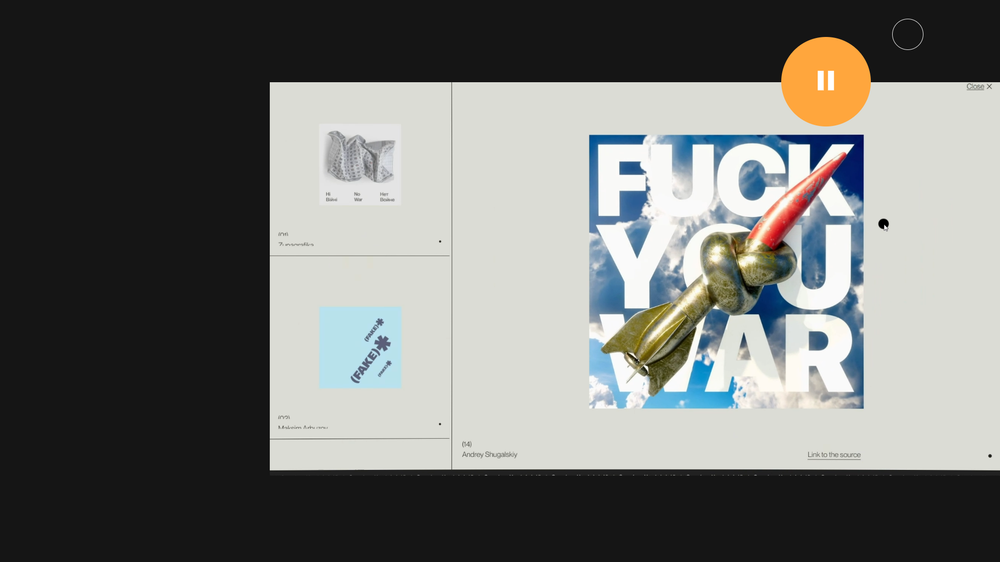

# OBYS Agency Clone

This project is a clone of the OBYS Agency website (https://www.obys.agency). It aims to replicate the design and functionality of the original site using modern web development technologies.

## Table of Contents

- [Overview](#overview)
- [Technologies Used](#technologies-used)
- [Screenshots](#screenshots)
- [Live Visit](#live-visit)

## Overview

The OBYS Agency Clone project demonstrates the ability to reproduce a sophisticated, professional website design. It includes smooth transitions and animations to provide an engaging user experience.

## Technologies Used

- HTML5
- CSS3
- JavaScript (ES6+)
- GSAP (GreenSock Animation Platform)

## Screenshots

 
From Obys: Our agency is about people who love creating, designing and developing wow projects. In the same time we are a boutique agency that is more than the collective. We learn and grow, win and celebrate together.

 

 

## [Oliver Felix](https://www.instagram.com/oliverfelix1453?igsh=d25yYTh5a3poYnJ0)
